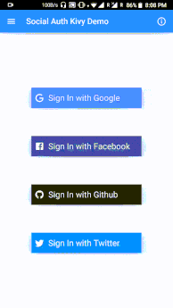

# KivyAuth
#### *Integrate Google, Facebook, Github &amp; Twitter login in kivy applications*
[](https://travis-ci.org/github/shashi278/social-auth-kivy/) [](https://www.python.org/downloads/release/python-360/) [](https://pypi.org/project/KivyAuth/) [](https://github.com/shashi278/social-auth-kivy/blob/master/LICENSE) [](https://pypi.org/project/KivyAuth/#modal-close) [](https://pypi.org/project/KivyAuth/)

###


##

### How to use
Using this library is very easy.
The example below shows the basic usage of the library by integrating google login.

* Add [prerequisite](docs/integrate-google-facebook-login.md#prerequisite) for google login before proceeding further

* Include necessary imports for google login
```python
from kivyauth.google_auth import initialize_google, login_google, logout_google
```

* Initialize google login inside your app's build method
```python
def build(self):
  #..
  initialize_google(self.after_login, self.error_listener)
  #..
```
`success_listener` is a function to be called upon successful login with `name`, `email`, and `photo url` of the user. So, create a success listener function which accepts three parameters and perform after-login stuffs. `error_listener` doesn't accept any argument.

* Next, call `login_google()` upon a button click to initiate login process.

* Similarly, to logout, call `logout_google` as
```python
logout_google(self.after_logout)
```
`after_logout` is a function to be called after user gets logged out. For example, to update UI.

* Make sure to include `kivyauth` as a requirement in the buildozer.spec file
```spec
requirements = python3,kivy,kivyauth
```

* See [demo](demo/) for reference

A more comprehensive documentation is on it's way.

### Changelog
#### v2.0
  * Individual login providers are moved into respective folders
  * Fix problem of not being able to use individual login methods
  * Now it's relatively easier to use the library

### Other
Feel free to ping me or raise issues if there's any difficulty in packaging it up.

Star this repo if you think it's useful.
